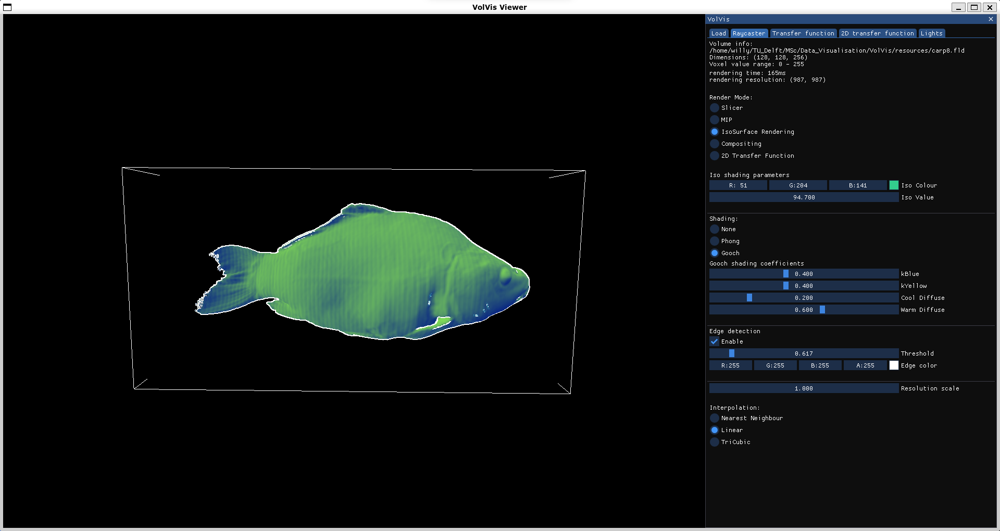
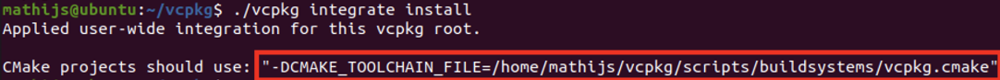

# VolVis Project
Visualisation of voxel-based volumes via ray-marching. Developed for the VolVis project submission belonging to Group 12 for the course IN4089 Data Visualisation.

## Group Members
- Nikolay Blagoev (4998901)
- Tobias van den Hurk (4938836)
- William Narchi (5046122)

## How to Run
### vcpkg
Before building this project, you will need to install [vcpkg](https://github.com/microsoft/vcpkg). These steps assume that CMake and a modern C++ compiler are already installed

0. (Optional - Linux only) Install `git`, `curl`, `unzip`, `tar`, and the OpenGL development libraries  
`sudo apt install git curl unzip tar`  
`sudo apt install libxinerama-dev libxcursor-dev xorg-dev libglu1-mesa-dev`  
1. Clone vcpkg from github  
`git clone https://github.com/microsoft/vcpkg.git`
2. Navigate to the cloned directory  
`cd vcpkg`
3. Compile vcpkg   
`./bootstrap-vcpkg.sh -disableMetrics` (Linux)  
`./bootstrap-vcpkg.bat -disableMetrics` (Windows)
4. Enable IDE/code editor integration and note down the output which CMake projects should use  
`./vcpkg integrate install`  

5. Add the output from the previous step to CMake's arguments

### Build Instructions
As this project uses CMake, simply use your favourite CLI/IDE/code editor and compile the `Viewer` target

## Features
- Tri-linear interpolation of voxel values at relevant hit points
- First-hit direct volume rendering (DVR/ Iso-Surface Rendering)
- [Phong shading](https://en.wikipedia.org/wiki/Phong_reflection_model) for DVR
- Compositing with 1D transfer function
- Compositing with 2D transfer function
- [Gooch shading](https://en.wikipedia.org/wiki/Gooch_shading) for DVR
- Edge highlighting via [Sobel edge detection](https://en.wikipedia.org/wiki/Sobel_operator)
- Light placement via GUI editor
